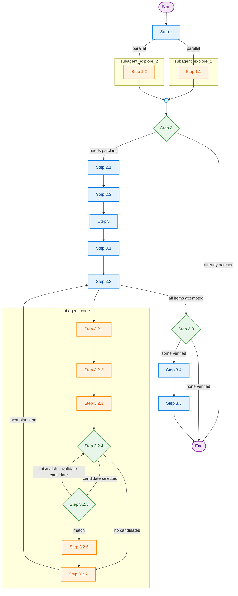

# Integrate TileGym kernels to Transformers
The main purpose of TileGym project is to provide performant kernels for LLM training and inference. We will integrate proper kernels available in TileGym project to LLM models provided by Hugging Face `transformers` library to validate end-to-end functional correctness and performance improvements. Instead of modifying `transformers` source code, we will take a non-intrusive monkey-patch approach: We will replace certain modules/classes/methods in `transformers` library that implement the Transformer model we would like to integrate, such that at model instantiation, that model's core components will be replaced by TileGym implementations. At runtime the model will actually invoke TileGym kernels under the hood.

## Instructions
The integration process follows a "research kernel requirement and supply -> propose kernel integration candidates -> implement kernel integrations and verify -> aggregate valid integrations" workflow. Refer to the diagram below to understand the overall process, then check the numbered text below for details. If you find it difficult to interpret embedding Mermaid script, check the rendered PNG image which represents the exactly identical workflow diagram:
<details>


</details>



- Mapping note: `Step 1.1/1.2` correspond to the two explore-subagent bullets under Step 1; `Step 2.1/2.2` correspond to the two plan sub-steps under Step 2; `Step 3.2.1-3.2.7` correspond to the code-subagent sub-steps under Step 3.2.

### Detailed Steps
1. Research phase: Study the target Transformer model and available kernel and monkey-patch implementation in TileGym. Launch 2 parallel explore subagents:
   * Search the model ID on HuggingFace to know what architectures does it use. Then search GitHub code to get implementation of that architecture. Go through details to understand computations performed on every components. Summarize a comprehensive requirement list with all necessary details included. *Focus on details*. Some model might use variants of standard Attention/MoE/normalization, and/or use distinct data types at different part of computations;
   * Go through @src/tilegym/ to inventory available kernel implementations, OP interfaces, and Transformer model monkey-patches. Pay attention to the `@dispatch("<OP name>")` and `@register("<OP name>")` mappings, and `apply_tilegym_kernel_to_<transformer_module>` patch patterns. Summarize a manifest that list all available monkey-patch functions, OP interfaces, kernel implementations with sufficient details to distinguish variants of operations. *Refer to but don't rely on docstring/comments; focus on details that distinct similar kernels*. If unsure about `cuda.tile` kernel semantic, check https://docs.nvidia.com/cuda/cutile-python/operations.html.
2. Plan phase: Check if the target model architecture is already patched. If so, inform the user and exit; Otherwise, propose an integration plan following these sub-steps:
   1. Check the requirement list and manifest to determine which set of computations could be patched by TileGym implementations. Be optimistic since subsequent steps/subagents will drop unsuitable proposals;
   2. For each of the computation selected at previous sub-step, propose matching TileGym OP interfaces or/and concrete kernel implementations. You may propose multiple candidates if uncertain, but do keep candidate pool small using your best judgement.
3. Execute-and-verify phase: Prepare develop environment, launch subagents to implement monkey-patch for each of the items in integration plan once-a-time, verify it on develop environment, and accept/reject that monkey-patch. Specific sub-steps:
   1. The orchestrator agent (i.e., you) prepares a GPU develop environment by following [environment-setup.md](./references/environment-setup.md). This environment will be used by subsequent subagents.
   2. For each of the unverified integration plan item (i.e., a mapping of Transformer model compute <-> one or more TileGym implementation candidates), launch a parallel code subagent with VERY STRONG plan-following and debugging ability. Tell this subagent the allocated node name at sub-step 3.1. Workflow of this code subagent is:
      1. Study src/tilegym/transformers/monkey_patch.py and modeling/transformers/infer.py to understand how to monkey-patch a transformer compute with TileGym implementation. Study [docker-gpu-guide.md](./references/docker-gpu-guide.md). If any subsequent step requires executing a script, always SSH to the node name given by the orchestrator agent, build or rebuild image by modeling/transformers/Dockerfile if needed, and execute that script in the NVIDIA Docker environment;
      2. Locate the integration point at `transformers` library. E.g., It could be a `nn.Module` subclass that corresponds to a layer in the transformer model, or an utility function that applies certain modification to transformer models' intermediate variables/tensors. Use GitHub MCP search_code for unseen imports;
      3. Collect inputs and outputs around integration point to serve as subsequent verifications' references. You can create a simple debug Python script that calls `transformers` library's `.generate()` API to prompt the Transformer model to output "The capital of France is", and add code before and after the integration point to save intermediate PyTorch tensors and other necessary variables to disk as future references. *Critical: unoptimized `.generate()` is slow, collect as less data as possible*;
      4. Select the next unverified TileGym implementation candidate. If no unverified candidate available, exit current subagent and let the orchestrator agent know that the current Transformer compute is unsuitable for TileGym to patch; Otherwise, implement a monkey-patch function following the convention studied at sub-step 3.2.1. The patch function of current compute goes to src/tilegym/transformers/<submodule_name>/monkey_patch_<compute_name>.py. If additional modifications are need for the current transformer model (similar to the scenario of src/tilegym/transformers/deepseek2/modeling_deepseek.py), check existence (create by other subagents) or create a self-contained Python submodule src/tilegym/transformers/<submodule_name>/modeling_<submodule_name>.py and place modifications there;
      5. Verify the monkey-patch implementation at sub-step 3.2.4 by creating a Python script that instantiate a submodule that contains integration point, apply the monkey-patch, feed input data collected at sub-step 3.2.3, and collect output data. The output data should match the reference output collected at sub-step 3.2.3 within a reasonable error tolerance. Try your best to fix errors caused by integration and to resolve mismatch. If can't fix, mark current TileGym implementation candidate as invalid and go back to sub-step 3.2.4; Otherwise continue to next sub-step;
      6. Consolidate the debug and test code you implemented to src/tilegym/transformers/<submodule_name>/test_monkey_patch_<compute_name>.py and organize it in pytest style and remove all other files/scripts/documents/binary data files you created during debugging. Ensure only left one test case that checks input-output around the integrating point match with those from origin implementation and ensure the test case pass. At this point, src/tilegym/transformers/<submodule_name>/ directory should look like:

         ```text
         src/tilegym/transformers/<submodule_name>/
         |- monkey_patch_<compute_name>.py  # Patch function for compute assigned to current subagent.
         |- test_monkey_patch_<compute_name>.py  # Test logic specific to <compute_name> patching.
         |- # Optional [monkey_patch_<other_compute_name>.py, test_monkey_patch_<other_compute_name>.py] pairs created by other subagents assigned with <other_compute_name>s.
         |- modeling_<submodule_name>.py  # Optional if need to modify submodule or function, could be initially created by other subagents.
         ```
      7. Exit the current subagent and let orchestrator agent know that the assigned Transformer compute can be patched by TileGym implementation verified at sub-step 3.2.5 and 3.2.6 and the patch function is available at src/tilegym/transformers/<submodule_name>/monkey_patch_<compute_name>.py.
   3. Aggregate all verified computes and corresponding patches. If none of the compute can be faithfully integrated, exit the workflow and let users know; Otherwise, aggregate all patching logic to a main monkey-patch function `def apply_tilegym_kernel_to_<submodule_name>(...)` and place it at src/tilegym/transformers/monkey_patch.py. Each compute has a corresponding boolean flag as function argument;
   4. Update modeling/transformers/infer.py to include the main monkey-patch function in the inference and benchmark flow. Create a Bash script modeling/transformers/bench_<submodule_name>.sh similar to other bench scripts in that directory. Ensure to use `--use_cutile` at 2nd infer.py call, as we most focus on cuTile backend;
   5. Study [docker-gpu-guide.md](./references/docker-gpu-guide.md), SSH to the node name allocated at sub-step 3.1, build image by modeling/transformers/Dockerfile and verify the end-to-end inference script created at sub-step 3.4. Once all tests pass, release the GPU node.
